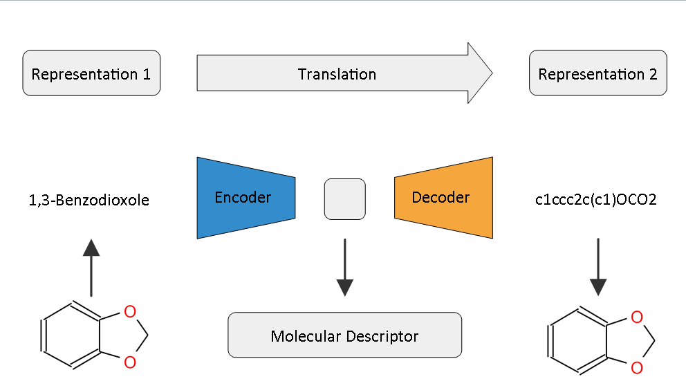

# Continuous and Data-Driven Descriptors (CDDD)

Implementation of the Paper "Learning Continuous and Data-Driven Molecular
Descriptors by Translating Equivalent Chemical Representations" by Robin Winter, Floriane Montanari, Frank Noe and Djork-Arne Clevert.<sup>1</sup>
 

## Installing

### Prerequisites
```
python 3
tensorflow 1.10
numpy
rdkit
scikit-learn
```
### Conda
Create a new enviorment:
```
git clone git@by-gitlab.de.bayer.cnb:GGWAQ/cddd.git
cd cddd
conda env create –f environment.yml
source activate cddd
pip install .
```

### Testing
Extract molecular descriptors from two QSAR datasets and evaluate the perfromance of a SVM trained on these descriptors.
```
cd example
python3 run_qsar_test.py
```
The accuracy on the Ames dataset should be arround 0.814 +/- 0.006.
The r2 on the Lipophilicity dataset should be arround 0.731 +/- 0.029.

## Getting Started
### Extracting Molecular Descripotrs
Run the script run_cddd.py to extract molecular descripotrs of your provided SMILES:
```
run_cddd.py --input smiles.smi --output descriptors.csv  --smiles_header smiles
```
Supported input: 
  * .csv-file with one SMILES per row
  * .smi-file with one SMILES per row

For .csv: Specify the header of the SMILES column with the flag --smiles_header (default: smiles)

### Inference Module
The pretrained model can also be imported and used directly in python via the inference class:
```
import pandas as pd
from cddd.inference import InferenceModel
from cddd.preprocessing import preprocess_smiles
```
Load and preprocess data:
```
ames_df = pd.read_csv("example/ames.csv", index_col=0)
ames_df["smiles_preprocessed"] = ames_df.smiles.map(preprocess_smiles)
smiles_list = ames_df["smiles_preprocessed"].tolist()
```
Create a instance of the inference class:
```
inference_model = InferenceModel()
```
Encode all SMILES into the continuous embedding (molecular descriptor):
```
smiles_embedding = inference_model.seq_to_emb(smiles_list)
```
The infernce model instance can also be used to decode a molecule embedding back to a interpretable SMILES string:
```
decoded_smiles_list = inference_model.emb_to_seq(smiles_embedding)
```
### References
[1] https://pubs.rsc.org/en/content/articlelanding/2019/sc/c8sc04175j#!divAbstract


